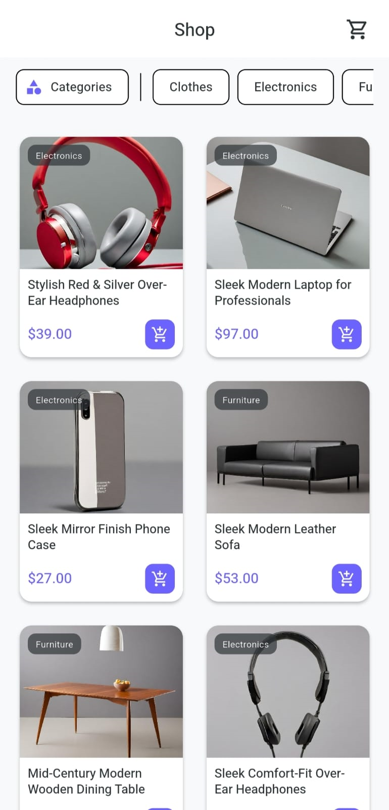
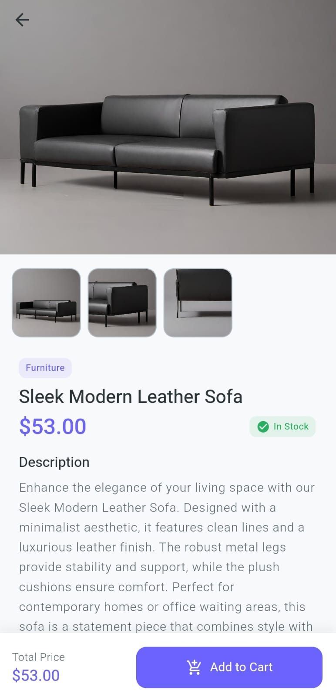
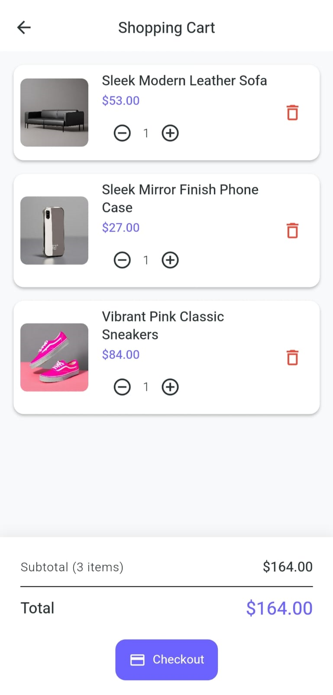
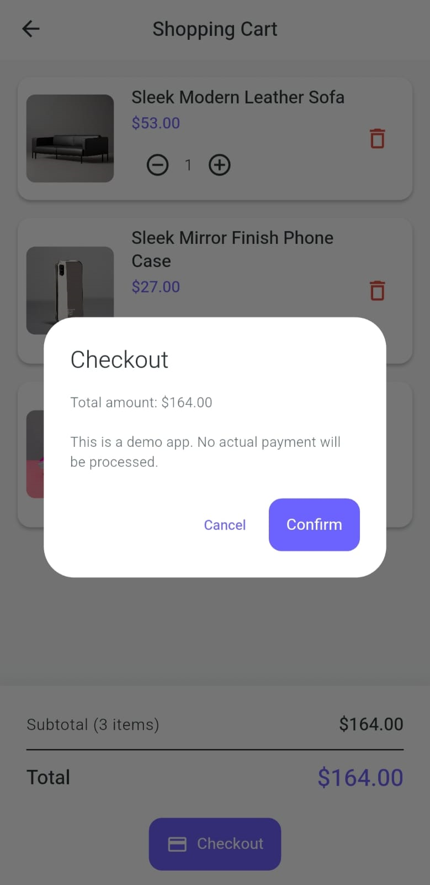

# 🛍️ Flutter Dummy Shopping App

A modern and scalable **Flutter E-Commerce Demo Application** built using **Provider State Management** and REST API integration.

This project demonstrates clean architecture, professional UI design, cart quantity management, and a complete checkout flow.

---

## 🚀 Features

### 🏠 Home Screen
- Fetches products from API
- Displays products in grid layout
- Smooth navigation to Product Details
- Hero animations for images

### 📄 Product Detail Screen
- Image preview with SliverAppBar
- Category badge
- Product description
- Add to Cart / Remove from Cart functionality

### 🛒 Cart Screen
- Displays unique products
- Quantity management (+ / -)
- Remove single quantity
- Remove entire product
- Subtotal & Total calculation
- Checkout dialog
- Empty cart UI state

---

## 📸 App Screenshots

### 🏠 Home Screen

### 📄 Product Detail Screen

### 🛒 Cart Screen

### 💳 Checkout Dialog

---

### 👤 Author & Contact

### **MaryamAppDev**

---